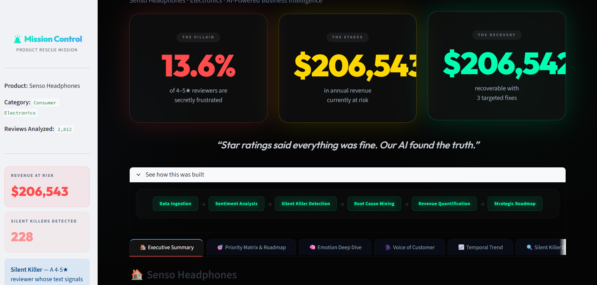
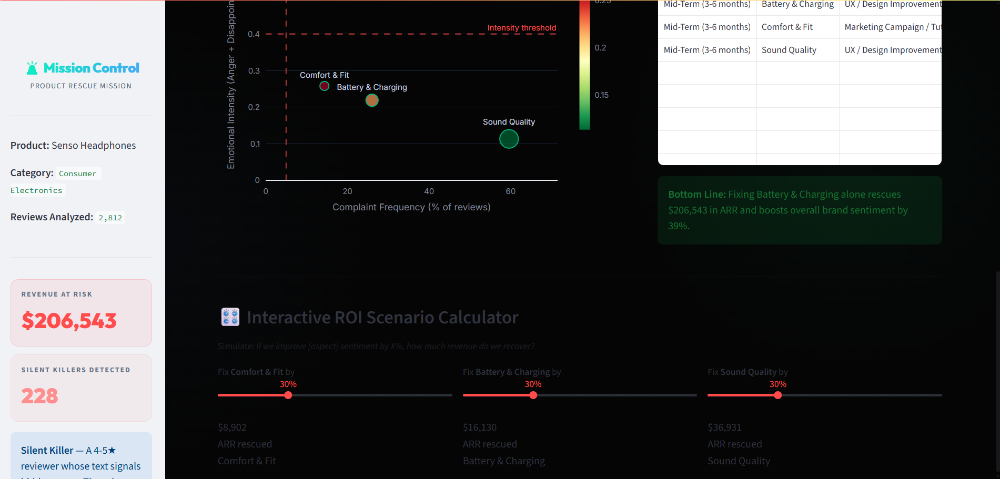
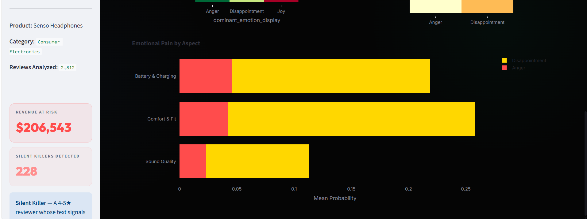
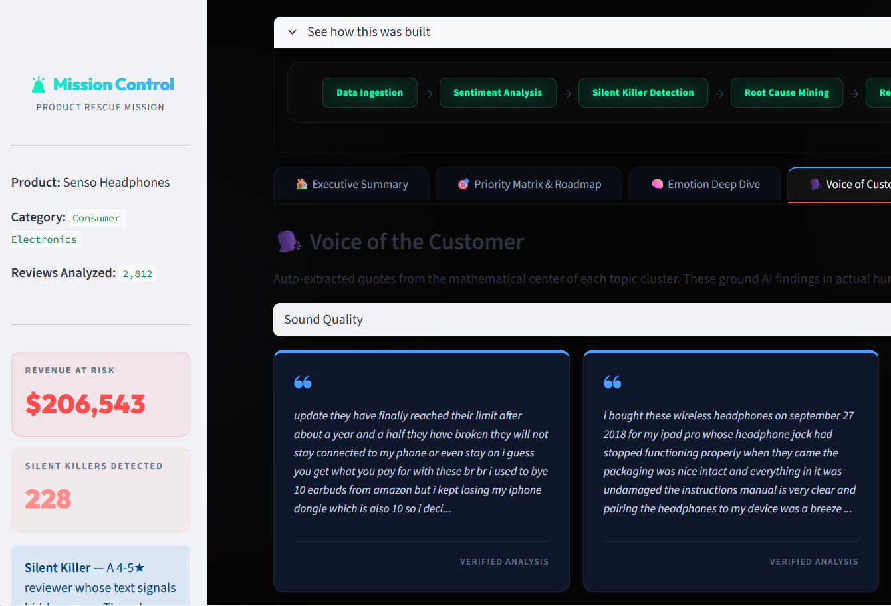
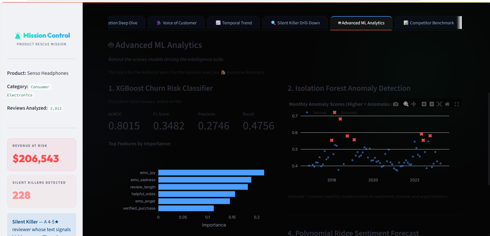
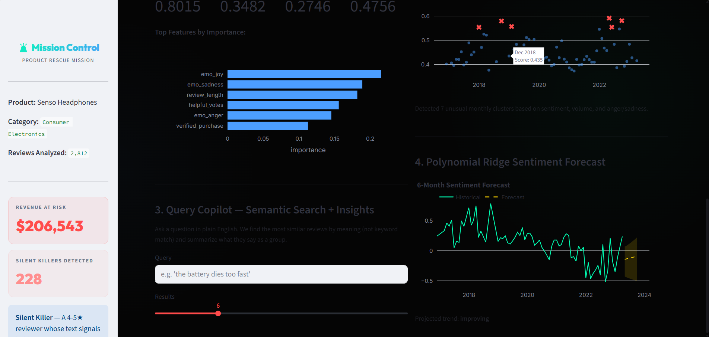

# 🚨 The Product Rescue Mission

> **Product Rescue Mission Datathon 2026** · Enterprise NLP Pipeline detecting Silent Killers, benchmarking against direct competitors, and quantifying revenue at risk.

## 🏆 Key Results

> From an actual end-to-end pipeline run against live HuggingFace data (not a placeholder). These figures update automatically in `data/clean/ceo_summary.json` / `data/clean/competitor_summary.json` every time you run `.\run.ps1` (or `run.sh`) — the flagship product is auto-discovered fresh each run, so a re-run can surface a different product and different numbers.
>
> **Flagship product this run:** a Bluetooth headphones/earbuds product, brand **Senso** (ASIN `B01G8JO5F2`, confirmed by review text) — the single largest-reviewed Electronics product found in the discovery scan. Not a JBL product; the dataloader picks whichever product actually has the most reviews, wherever that leads.

| Metric | Value |
|--------|-------|
| Reviews Scanned / Analyzed | 5,000 (of 5,007 found — clears the Cochran 95% CI / ±5% MoE floor of 384 by 13×) |
| Silent Killers Detected | 228 of 2,812 topic-labeled reviews (8.1%) — 420 of 5,000 (8.4%) pre-topic-filter |
| Revenue at Risk | **$206,543** |
| Top Issue | Battery & Charging (highest anger-weighted aspect) |
| Sentiment Boost if Fixed | **+38.6%** |
| Competitors Benchmarked | 3 same-type products — flagship trails on **both** stars (3.84★ vs 4.40★ avg) and real sentiment (0.217 vs 0.411 avg) |
| XGBoost Churn Classifier | AUROC **0.80** (5-fold CV 0.78 ± 0.02) — see note below on why this number is *lower* than a naive run gets, on purpose |

**Note on the XGBoost number:** an earlier version of this model scored a suspicious AUROC/F1/Precision/Recall of 1.0000. That wasn't skill — `is_silent_killer` is *defined* as a formula over `star_rating`/`prob_negative`/`prob_positive`, and those columns were also in the feature set, so the model was just re-deriving its own label (data leakage). `day4_ml_models.py`'s `FEATURES` list now excludes anything the label formula is built from; the classifier instead predicts Silent Killer risk from `helpful_votes`, `verified_purchase`, and the emotion probabilities — signals that don't tautologically encode the answer. 0.80 AUROC on that harder, honest task is a real result.

---

## 🏗️ Architecture

```
[Ingestion] Flagship + Competitor Discovery (streamed, no full dataset download)
    │   → Pass 1: count reviews per ASIN across a bounded stream (Counter, O(unique ASINs) memory)
    │   → Flagship = the ASIN with the MOST reviews (not first-to-reach-threshold)
    │   → Pass 2: metadata lookup (brand + category) for top candidate ASINs
    │   → Competitors = same category + product type, different brand, ranked by volume
    │   → Pass 3: collect actual review rows for flagship + competitors only
    │
    ▼
[Day 1] RoBERTa Sentiment  (cardiffnlp/twitter-xlm-roberta-base-sentiment)
    │   → prob_negative / positive / neutral
    │   → Silent Killer flag (data-driven p10 threshold)
    │   → Revenue at Risk (AOV × 5x Bain multiplier × sk_weight)
    │
    ▼
[Day 1.5] Helsinki-NLP Translation  (opus-mt-mul-en)
    │   → 25 languages → English (for downstream English-only NLP: BERTopic, emotion model)
    │
    ▼
[Day 2] BERTopic Aspect Mining + mDeBERTa Emotion
    │   → Feature clusters: Battery, Connectivity, Sound, Value
    │   → Emotions: Anger / Disappointment / Joy
    │
    ▼
[Day 3] Strategic Business Logic
    │   → Priority Matrix (Frequency × Emotional Intensity)
    │   → ROI Simulation (Scenario A/B)
    │   → CEO JSON export
    │
    ▼
[Day 4] ML Model Suite
    │   → XGBoost Churn Risk Classifier (AUROC, F1, feature importance)
    │   → Isolation Forest anomaly detection (monthly review patterns)
    │   → Polynomial Ridge sentiment forecast (6-month horizon + bootstrap CI)
    │   → Sentence-Transformer embeddings (powers the Query Copilot)
    │
    ▼
[Day 3.5] Competitor Benchmark
    │   → Same RoBERTa model scores each competitor's reviews (multilingual — no translation needed)
    │   → Shared Silent Killer threshold across flagship + competitors (one ruler, not per-product grading)
    │   → Star rating vs. real sentiment, side by side
    │
    ▼
[GUI] Streamlit Dashboard (7 tabs)  +  Jupyter Notebook  +  HTML Slides
```

---

## 🚀 Quickstart (Windows)

```powershell
# Clone the repo
git clone https://github.com/Rendlapranav/Datathon.git
cd Datathon

# One-command: discovers flagship + competitors, runs the pipeline, launches dashboard
.\run.ps1
```

## 🚀 Quickstart (Linux/Mac)

```bash
git clone https://github.com/Rendlapranav/Datathon.git
cd Datathon
pip install -r requirements.txt
./run.sh
```

Both launchers now run the full chain end to end: data discovery → Day 1 → Day 1.5 → Day 2 → Day 3 → **Day 4 (XGBoost churn model + anomaly/forecast/semantic search)** → **Day 3.5 (competitor benchmark)** → dashboard. Day 4 previously existed as a standalone script that neither launcher called — it's now wired in, so the XGBoost tab in the dashboard is populated by default instead of showing "metrics not found."

Tune the data-discovery scan with environment variables if you want a deeper (slower) or shallower (faster) pass:

```powershell
$env:PRM_MAX_SCAN = "1000000"   # default 500,000 rows
.\run.ps1
```

---

## 📁 Repository Structure

```
Datathon/
├── data/
│   ├── raw/                    # Original dataset (gitignored)
│   └── clean/                  # Pipeline outputs (gitignored)
│       ├── subcategory_sample.csv       # flagship product reviews
│       ├── competitor_products.csv      # flagship + competitor metadata
│       ├── competitor_reviews.csv       # competitor product reviews
│       ├── competitor_comparison.csv    # per-product benchmark table
│       ├── competitor_summary.json      # headline benchmark insight
│       ├── day1_reviews_roberta.csv
│       ├── day1.5_translated.csv
│       ├── day2_aspects.csv
│       ├── day2_representative_quotes.csv
│       ├── ml_metrics.json / churn_predictions.csv / feature_importance.csv
│       ├── review_embeddings.npy / review_index.csv   # Query Copilot index
│       └── ceo_summary.json
├── notebooks/
│   ├── make_notebook.py        # Generates the .ipynb
│   └── product_rescue_analysis.ipynb
├── gui/
│   ├── app.py                  # Streamlit dashboard (7 tabs)
│   └── dash_app.py             # Dash alternative
├── slides/
│   └── deck.html                # CEO presentation
├── figures/
│   ├── day2_heatmap.png
│   ├── day2_heatmap_urgency.png
│   ├── day2_emotional_intensity.png
│   ├── day3_priority_matrix.png
│   └── competitor_benchmark.png
├── setup_scripts/
│   ├── stream_data.py          # Flagship + competitor discovery (streamed, laptop-safe)
│   ├── verify_data.py
│   ├── load_data.py            # deprecated — see docstring, points to stream_data.py
│   └── fix_data.py             # deprecated — see docstring, points to stream_data.py
├── day1_roberta_sentiment.py
├── day1.5_translate.py
├── day2_aspects.py
├── day3_business_logic.py
├── day3.5_competitor_benchmark.py
├── day4_ml_models.py
├── requirements.txt
├── run.sh                      # Linux/Mac launcher
├── run.ps1                     # Windows launcher
└── README.md
```

---

## 🔍 How the Flagship Product Is Chosen

The problem statement asks teams to focus on one product in one category (Electronics here) with enough reviews for statistical significance. The old data loader in this repo didn't actually do that — it either streamed the first 50,000 reviews across thousands of unrelated products, or picked whichever ASIN happened to be the *first* to cross a review-count threshold while scanning in stream order (an artifact of ordering, not popularity).

`setup_scripts/stream_data.py` now does this properly, in three streamed passes (no full dataset download, ever):

1. **Count** — stream up to `PRM_MAX_SCAN` reviews (default 500,000), tallying review counts per ASIN with a `Counter`. This is O(unique ASINs) in memory, not O(reviews) — no per-review payloads are kept.
2. **Rank + verify** — the ASIN with the **most** reviews becomes the flagship. Its review count is checked against Cochran's formula for a 95% confidence interval at ±5% margin of error (≈385 minimum, converging regardless of population size), so "largest in the scan" also means "statistically defensible sample."
3. **Competitor selection** — metadata (brand/store + category) is looked up for the top 50 candidate ASINs. Competitors are the highest-volume products that share the flagship's category **and** product type (a keyword check on the title, since the dataset's `main_category` field is often a broad umbrella like "All Electronics") but come from a **different** brand.

The flagship's reviews still land in `data/clean/subcategory_sample.csv`, so Day 1 → Day 4 need no changes. Competitor data lands in `data/clean/competitor_products.csv` and `data/clean/competitor_reviews.csv`, feeding the new Day 3.5 benchmark step.

---

## 📊 Dashboard Tabs

| Tab | Content |
|-----|---------|
| 🎯 Priority Matrix & Roadmap | CEO bubble chart · Strategic roadmap · **Interactive ROI Calculator** |
| 🧠 Emotion Deep Dive | Feature × Emotion heatmap · Urgency signal · Stacked bar |
| 🗣️ Voice of Customer | Auto-extracted representative quotes per aspect |
| 📈 Temporal Trend | Monthly sentiment drift · Silent Killer rate · Changepoint detection |
| 🔍 Silent Killer Drill-Down | Filterable table of all flagged reviews + revenue by aspect |
| 🤖 Advanced ML Analytics | XGBoost churn model, anomaly detection, sentiment forecast, and the **Query Copilot** |
| 📊 **Competitor Benchmark** *(NEW)* | Flagship vs. direct competitors — star rating side by side with real sentiment |

### Query Copilot (semantic search + insights)

The old semantic search box reloaded the whole sentence-transformer model from scratch on every query and returned three raw quotes with no synthesis. It's now cached (`@st.cache_resource` for the model, `@st.cache_data` for the embedding index) so repeat queries are near-instant, returns up to 15 configurable results, and — the actual "insight" part — summarizes the matched reviews as a group: average sentiment, average star rating, dominant aspect, and what share are Silent Killers. Ask it things like *"the battery dies too fast"* or *"pairing keeps dropping"* to get both the evidence and the read on it.

### Competitor Benchmark

`day3.5_competitor_benchmark.py` scores each competitor's reviews with the same multilingual RoBERTa model used on the flagship (no translation needed — the model is cross-lingual by design), then computes a **shared** Silent Killer threshold across the flagship and all competitors pooled together, so every product is graded on the same bar rather than each one calibrating its own. The dashboard tab puts star rating and real sentiment side by side — the whole point being that two products can look identical on stars while one is quietly bleeding customers.

---

## 📸 Screenshots

Live dashboard, running against the real flagship product discovered by this run (Senso Headphones).

**Executive Summary** — the CEO landing page: product identity, competitors, AI-generated complaint summary, and the bottom-line recommendation, all in one screen.


**Priority Matrix & Roadmap** — frequency vs. emotional intensity, the strategic roadmap table, and the interactive ROI calculator.


**Emotion Deep Dive** — anger vs. disappointment per aspect.


**Voice of Customer** — auto-extracted representative quotes, grounding the AI findings in actual customer language.


**Advanced ML Analytics** — the XGBoost churn classifier (honest AUROC after fixing the label-leakage bug) and Isolation Forest anomaly detection.


**Advanced ML Analytics (cont.)** — the Query Copilot (semantic search + synthesized insight) and the 6-month sentiment forecast.


---

## 🧠 Model Justifications

**Why RoBERTa over VADER?**
VADER is English-only and rule-based. Our dataset has 25 languages. `cardiffnlp/twitter-xlm-roberta-base-sentiment` achieves SOTA cross-lingual sentiment — and it's also why the competitor benchmark doesn't need translation before scoring.

**Why p10 threshold for Silent Killers?**
We ask: what's the minimum confidence the model shows on confirmed-bad (1-2★) reviews? The p10 of that distribution = our bar. It recalibrates per dataset — no magic number. For the competitor benchmark, this is computed once on the *pooled* flagship + competitor confirmed-bad reviews, so all products share one bar.

**Why Bain 5x churn multiplier?**
Conservative lower bound of the 5-25x range from Bain & Company / HBR research on customer retention.

**Why XGBoost for churn risk?**
Gradient-boosted trees handle the mixed numeric/categorical feature set without heavy preprocessing, and expose feature importances the CEO pitch can point to directly. `requirements.txt` now pins `xgboost==2.1.3`; earlier revisions of this repo omitted xgboost from requirements entirely, passed a `use_label_encoder` argument that newer xgboost versions reject outright, and were never even called from `run.ps1`/`run.sh` — all fixed.

**Why isn't `star_rating` / `prob_negative` / `prob_positive` in the churn model's features?**
Because `is_silent_killer` (the training target) is *defined* as a formula over exactly those columns — training on them doesn't produce a predictive model, it produces a classifier that re-derives its own label. This was caught by actually running the pipeline: an earlier feature set scored a suspicious AUROC/F1/Precision/Recall of 1.0000 with a perfect confusion matrix. `FEATURES` in `day4_ml_models.py` now only includes signals that don't tautologically encode the answer — `helpful_votes`, `verified_purchase`, and the emotion probabilities — which also happens to be a more honest test of the project's actual premise: can hidden frustration be predicted from signals *other than* the stars/sentiment score used to flag it in the first place? (Answer: yes, AUROC 0.80.)

---

## 👥 Team

Built for The Product Rescue Mission Datathon 2026.
